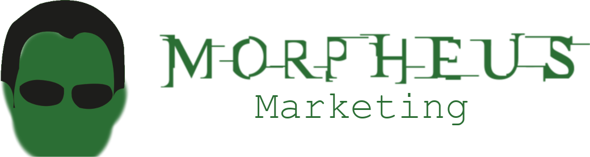
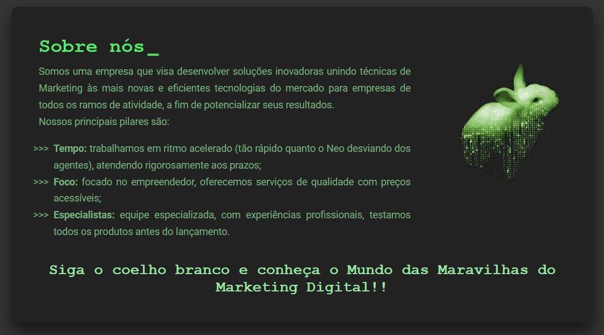

<div id=top></div>
<h1 align="center">

</h1>
<h2 align="center">&#x1F48A; Awakening your company to the market</h2>
<p align="center"><i>“Remember, all I’m offering is the truth. Nothing more."   - Morpheus, ‘The Matrix' (1999)</i> </p>
 <div align="center">
  
  
   
   
   
   
 </div>
<h3 align="center" >
   <b>&#x1F517;  <a  href="https://Morpheus-marketing-carol42.vercel.app/" style="color:#9AE6A4;">Go to the preview (Vercel)</a></b>
</h3>
<h4 align="center">:brazil: <a href="./README.md">Ir para a versão em Português deste README »</a>
</h4>

<div align="center">
    
</div>

<details>
    <summary>Table of Contents</summary>
    <ol>
        <li><a href="#pushpin-about">About</a></li>
        <li><a href="#dark_sunglasses-the-concept">The concept</a></li>
        <li><a href="#hammer_and_wrench-technologies">Technologies</a></li>
        <li><a href="#computer-how-to-download-the-project">How to download the project</a>
        </li>
        <li><a href="#woman_technologist-the-developer">The developer</a></li>
    </ol>
</details>


## :pushpin: About

<p>This project was one of the phases of the selective process of the E<sup>2</sup>C Júnior (Computer Engineering Junior Enterprise, from State University of Ponta Grossa).</p>
<p>The proposal was to build a Landing Page. We had the freedom to choose what it was about, but we had some evaluation criteria that we needed to meet.</p>

<p align="right"><a href="#top"></a></p>

## :dark_sunglasses: The concept
<p>Morpheus Marketing is a Digital Marketing Consulting Company, focusing on the small and medium entrepreneur.</p>
<p>Their main services are aimed at developing innovative marketing solutions for companies that do not know or make little use of the digital in their promotions.</p>
<p>This way, Morpheus's main goal is to "awake" those companies, demonstrating all the potential that Digital Marketing can have in leveraging their results.</p>
<p>This company concept was inspired by my Final Paper of the Business Administration Course, written in 2020. To see more about it, you can open the PDF <a href="https://drive.google.com/file/d/1TF01c4rWMB9ROPSLJ_wq8yyNkE38nF9o/view?usp=sharing">here</a>.</p>

<div align="center">

</div>

<p align="right"><a href="#top"></a></p>

## :hammer_and_wrench: Technologies

- [HTML](https://developer.mozilla.org/en-US/docs/Web/HTML)
- [CSS](https://developer.mozilla.org/en-US/docs/Web/CSS)
- [JavaScript](https://developer.mozilla.org/en-US/docs/Web/JavaScript)
- [Google Fonts](https://fonts.google.com/specimen/Roboto)
- [Font Awesome](https://fontawesome.com/v5.15/icons?d=gallery&p=2)
- [Font Meme](https://fontmeme.com/matrix-font/)

<p align="right"><a href="#top"></a></p>

## :computer: How to download the project

```bash
# Clone the repository
$ git clone https://github.com/Carol42/Morpheus-Landing-Page

# Go to the directory
$ cd Morpheus-Landing-Page

# Start the project (Windows)
$ start index.html

# Start the project (Linux - Debian-based distros)
$ xdg-open index.html

# Start the project (MacOs)
$ open index.html
```
<p align="right"><a href="#top"></a></p>

## :woman_technologist: The developer


</br>
<strong>Caroline Heloíse de Oliveira</strong>
</br>
<sup>Computer Engineering Student (UEPG)</sup>
</br>

<a href="https://github.com/Carol42"></a>
<a href="https://linkedin.com/in/carol42"></a>
<a href="mailto:carol42.helo@gmail.com"></a>

<p align="right"><a href="#top"></a></p>
