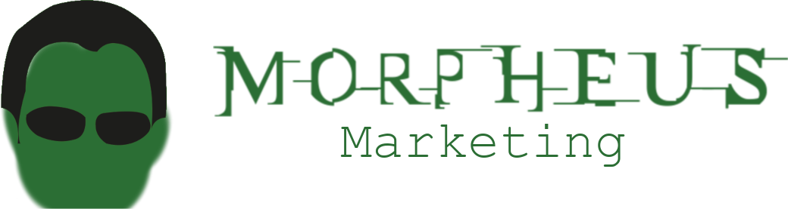
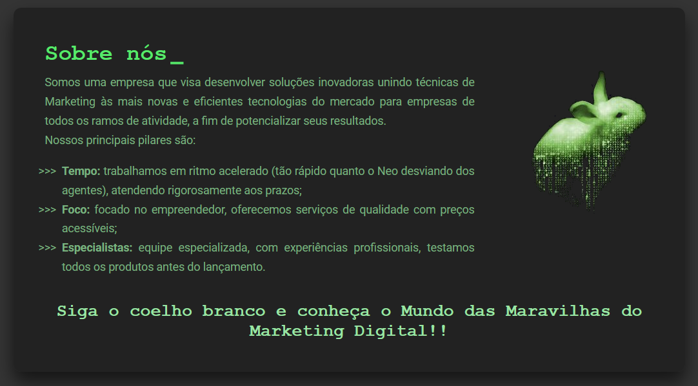

<div id=topo></div>
<h1 align="center">

</h1>
<h2 align="center">&#x1F48A; Acordando a sua empresa para o mercado</h2>
<p align="center"><i>“Remember, all I’m offering is the truth. Nothing more."   - Morpheus, ‘The Matrix' (1999)</i> </p>
 <div align="center">
  
  
   
   
   
 </div>
<h3 align="center" >
   <b>&#x1F517;  <a  href="https://Morpheus-marketing-carol42.vercel.app/" style="color:#9AE6A4;">Acessar a demonstração</a></b>
</h3>
<h4 align="center">:us::gb: <a href="./README-en.md">Go to the English version of this README »</a>
</h4>

<div align="center">
    
</div>

<details>
    <summary>Sumário</summary>
    <ol>
        <li><a href="#pushpin-sobre">Sobre</a></li>
        <li><a href="#dark_sunglasses-o-conceito">O conceito</a></li>
        <li><a href="#hammer_and_wrench-tecnologias-utilizadas">Tecnologias utilizadas</a></li>
        <li><a href="#computer-como-baixar-o-projeto">Como baixar o projeto</a>
        </li>
        <li><a href="#woman_technologist-a-desenvolvedora">A desenvolvedora</a></li>
    </ol>
</details>

## :pushpin: Sobre

<p>Esse projeto faz parte de uma das etapas do processo seletivo da E2C Júnior (Empresa Júnior de Engenharia de Computação, da Universidade Estadual de Ponta Grossa).</p>
<p>A proposta era criar uma Landing Page de uma empresa com temática livre, mas seguindo alguns critérios de avaliação.</p>

<p align="right"><a href="#topo"></a></p>

## :dark_sunglasses: O conceito
<p>Morpheus Marketing é uma empresa de consultoria em Marketing Digital com foco no pequeno e médio empreendedor.</p>
<p>Seus principais serviços são voltados à elaboração de  soluções inovadoras de Marketing para empresas que não conhecem ou fazem pouco uso do digital em suas divulgações.</p>
<p>Dessa forma, o principal objetivo da Morpheus é "acordar" essas empresas, demonstrando todo o potencial que o Marketing Digital pode ter em alavancar os seus resultados.</p>
<p>O cenceito dessa empresa foi inspirado no meu TCC do curso Técnico em Administração, elaborado em 2020. Para saber mais sobre ele, acesse o  PDF <a href="https://drive.google.com/file/d/1TF01c4rWMB9ROPSLJ_wq8yyNkE38nF9o/view?usp=sharing">aqui</a>.</p>

<div align="center">

</div>

<p align="right"><a href="#topo"></a></p>

## :hammer_and_wrench: Tecnologias utilizadas

- [HTML](https://developer.mozilla.org/en-US/docs/Web/HTML)
- [CSS](https://developer.mozilla.org/en-US/docs/Web/CSS)
- [JavaScript](https://developer.mozilla.org/en-US/docs/Web/JavaScript)
- [Google Fonts](https://fonts.google.com/specimen/Roboto)
- [Font Awesome](https://fontawesome.com/v5.15/icons?d=gallery&p=2)
- [Font Meme](https://fontmeme.com/matrix-font/)

<p align="right"><a href="#topo"></a></p>

## :computer: Como baixar o projeto

```bash
# Clonar o repositório
$ git clone https://github.com/Carol42/Morpheus-Landing-Page

# Entrar no diretório
$ cd Morpheus-Landing-Page

# Iniciar o projeto (Windows)
$ start index.html

# Iniciar o projeto (Linux - Debian-based distros)
$ xdg-open index.html

# Iniciar o projeto (MacOs)
$ open index.html
```
<p align="right"><a href="#topo"></a></p>

## :woman_technologist: A desenvolvedora


</br>
<strong>Caroline Heloíse de Oliveira</strong>
</br>
<sup>Estudante de Engenharia de Computação (UEPG)</sup>
</br>

<a href="https://github.com/Carol42"></a>
<a href="https://linkedin.com/in/carol42"></a>
<a href="mailto:carol42.helo@gmail.com"></a>

<p align="right"><a href="#topo"></a></p>
